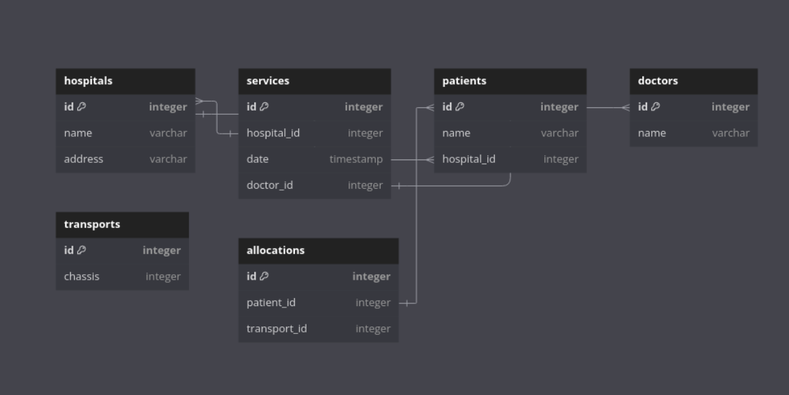
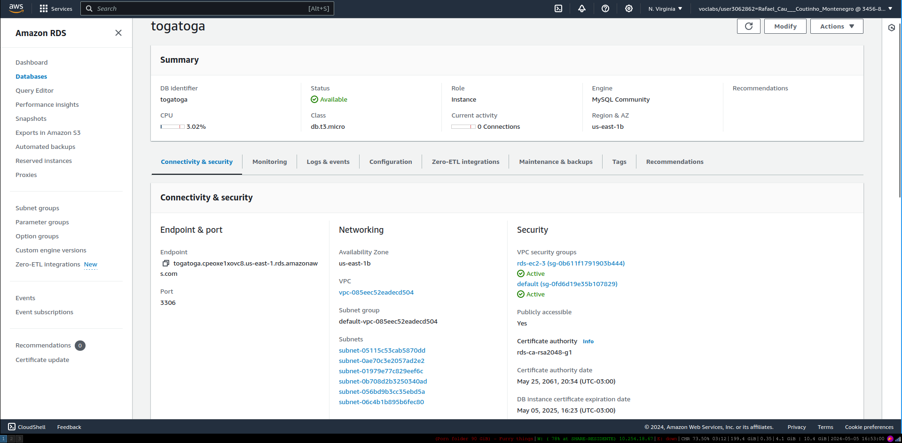
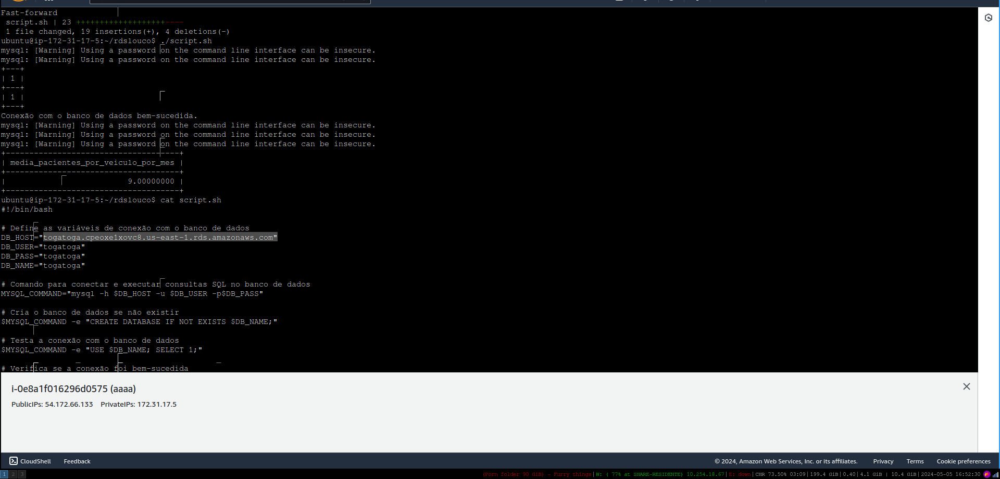
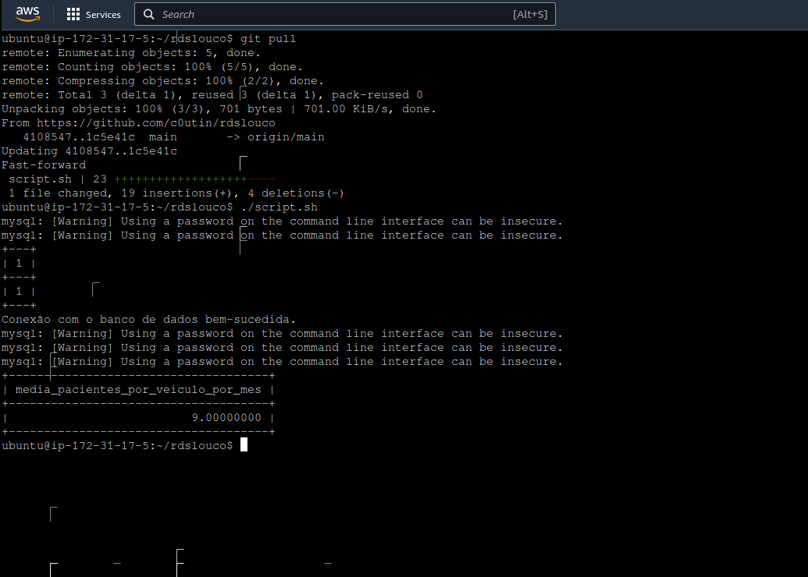

# Hospital Transport Database

This project contains scripts to set up a MySQL database for managing hospital transport data. It includes the creation of tables, insertion of sample data, and a SQL query to calculate the average number of patients transported per vehicle per month.

## Getting Started

### Prerequisites

- MySQL installed on your local machine or accessible server.
- Bash shell for running the provided script.

```bash
./script.sh
```

### Query Logic

The SQL query used to calculate the average number of patients transported per vehicle per month is as follows:

```sql
SELECT COUNT(allocations.id) / COUNT(DISTINCT YEAR(services.date)) / COUNT(DISTINCT MONTH(services.date)) AS media_pacientes_por_veiculo_por_mes
FROM allocations
INNER JOIN transports ON allocations.transport_id = transports.id
INNER JOIN services ON allocations.patient_id = services.id;
```

This query calculates the total number of allocations (patients transported) and divides it by the total number of distinct years and months in the services table. This gives the average number of patients transported per vehicle per month.

# DIAGRAM

This database model consists of six tables: hospitals, services, patients, doctors, transports, and allocations. Each table represents a different aspect of hospital transport management.

Hospitals Table: This table stores information about hospitals, including their unique identifier (id), name, and address. Hospitals are referenced by other tables to associate services, patients, and allocations with specific hospitals.

Services Table: The services table records details of services provided by hospitals, such as the service's unique identifier (id), the hospital where the service was performed (hospital_id), the date and time of the service (date), and the doctor responsible for the service (doctor_id). Each service is associated with a specific hospital and doctor.

Patients Table: The patients table contains information about patients, including their unique identifier (id), name, and the hospital they are associated with (hospital_id). Patients are linked to hospitals where they receive treatment.

Doctors Table: This table stores data about doctors, including their unique identifier (id) and name. Doctors are associated with services they perform at hospitals.

Transports Table: The transports table records information about vehicles used for patient transport, such as their unique identifier (id) and chassis number. Each transport vehicle is uniquely identified in the system.

Allocations Table: This table manages the allocation of patients to transport vehicles. It includes a unique identifier (id), the ID of the patient being transported (patient_id), and the ID of the transport vehicle used (transport_id). Each allocation links a patient to a transport vehicle for transportation.





# RDS PROOF


# CONN PROOF


# SCRIPT PROOF

